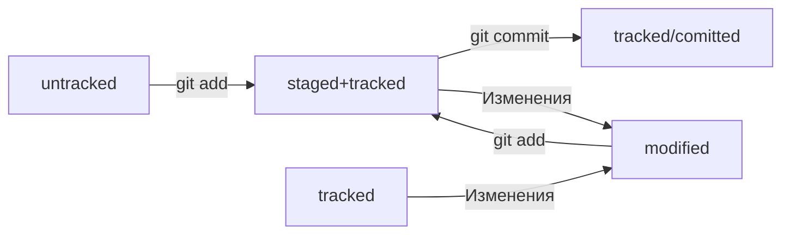

# Связываем локальный и удалённый репозитории

1. Копируем URL удаленного репозитория типа SSH.


2. Заходим в папку локального репозитория и вставляем следующее в терминал:

**git remote add** - привязать удаленный репозиторий к локальному


```

$ git remote add origin ***URL(SSH)**

```


P.s. origin - имя репозитория


3. Убеждаемся что репозитории связаны:

**git remote -v** - проверка связи


```
$ git remote -v


origin    git@github.com:%ИМЯ_АККАУНТА%/%ИМЯ-ПРОЕКТА%.git (fetch)


origin    git@github.com:%ИМЯ_АККАУНТА%/%ИМЯ-ПРОЕКТА%.git (push)

```


4. Отправляем изменения:

**git push** - отправка изменений


впервые: 

```

$ git push -u origin main (master)


```

---
---


# Хеш - основной индитификатор коммита


**git log** - вывести историю коммитов


**Хеширование** (от англ. hash, «рубить», «крошить», «мешанина») — это способ преобразовать набор данных и получить их «отпечаток».


Информация о коммите — это набор данных: когда был сделан коммит, содержимое файлов в репозитории на момент коммита и ссылка на предыдущий, или родительский (англ. parent), коммит.


   - если хеш получить дважды для одного и того же набора входных данных, то результат будет гарантированно одинаковый;
    
    
   - если хоть что-то в исходных данных поменяется (хотя бы один символ), то хеш тоже изменится (причём сильно).


Все хеши и таблицу **хеш → информация о коммите** Git сохраняет в служебные файлы. Они находятся в скрытой папке .git в репозитории проекта.


---
---


# Исследуем лог (от англ. log — «журнал [записей]») - описание коммита


**git log** - вывести список коммитов


### Описание состоит из:

- строка из цифр и латинских букв после слова commit — это хеш коммита;


- Author — имя автора и его электронная почта;


- Date — дата и время создания коммита;


- в конце находится сообщение коммита.


**git log --oneline** - получить сокращенный лог

В терминале появятся только первые несколько символов хеша каждого коммита и их комментарии.
Команда git log --oneline автоматически подбирает такую длину сокращённых хешей, чтобы они были уникальными в пределах репозитория и Git всегда мог понять, о каком коммите идёт речь.


---
---


# HEAD

Файл **HEAD** (англ. «голова», «головной») — один из служебных файлов папки **.git**. Он указывает на коммит, который сделан последним (то есть на самый новый).


Внутри **HEAD** — ссылка на служебный файл: **refs/heads/master** (или refs/heads/main в зависимости от названия ветки). Если заглянуть в этот файл, можно увидеть хеш последнего коммита.


При работе с Git указатель **HEAD** используется довольно часто. Мы уже упоминали, что многие команды Git принимают в качестве параметра хеш коммита. Если нужно передать последний коммит, то вместо его хеша можно просто написать слово **HEAD** — Git поймёт, что вы имели в виду последний коммит.


---
---


# Статусы файлов в Git


- **untracked** - неотслеживаемый


- **staged** - подготовленный - после **git add**


- **tracked** - отслеживаемый - после **git add** и **git commit**


- **modified** - файл был закоммичен и после этого изменён

---


### Цикл жизни файла в Git





1. Файл только что создали. Git ещё не отслеживает содержимое этого файла. Состояние: **untracked**.


2. Файл добавили в **staging area** с помощью **git add**. Состояние: **staged (+ tracked)**.
     
    
3. Сделали коммит с помощью **git commit**. Состояние: **tracked**.


4. Изменили файл. Состояние: **modified (+ tracked)**.


5. Снова добавили в **staging area** с помощью **git add**. Состояния: **staged (+ tracked)**.


6. Сделали коммит. Состояния: **tracked**.


7. Повторили пункты 4−7 много-много раз.


---
---


# Оформление сообщений к коммитмммам

У каждого коммита в Git есть сообщение — то, что передаётся после параметра **-m**. Например: **git commit -m "Добавить урок про оформление сообщений коммитов"**.


- Типичное правил: *«Сообщение не должно быть длиннее 72 символов»*.


### Сообщение должно быть:


- относительно коротким, чтобы его было легко прочитать;


- информативным.


---


### Корпоративный


Во многих компаниях применяется **Jira** — система для организации проектов и задач. У каждой задачи в **Jira** есть идентификатор из нескольких заглавных латинских букв и номера. Например, **LGS-239** значит, что это 239-я задача в проекте LGS (сокращение от англ. logistics — «логистика»).


В корпоративном стиле в начале сообщения обычно указывают Jira-ID, а после — текст сообщения.


```


$ git commit -m "LGS-239: Дополнить список пасхалок новыми числами" 


```


---


### Conventional Commits (англ. «соглашение о коммитах»)


**Conventional Commits** предлагает такой формат коммита: **<type>: <сообщение>**. Первая часть **type** — это тип изменений. Таких типов достаточно много. Вот два примера:


- feat (сокращение от англ. feature) — для новой функциональности;


- fix (от англ. «исправить», «устранить») — для исправленных ошибок.


```

git commit -m "feat: добавить подсчёт суммы заказов за неделю" 


```

---


### GitHub-стиль


GitHub можно использовать не только для хранения файлов проекта, но и для ведения списка задач (англ. issue) этого проекта. Если коммит «закрывает» или «решает» какую-то задачу, то в его сообщении удобно указывать ссылку на неё. Для этого в любом месте сообщения нужно указать #<номер задачи>. Например, вот так:


```

$ git commit -m "Исправить #334, добавить график температуры"

```


В таком случае GitHub свяжет коммит и задачу.


---
---


# Игнорирование файлов в Git


Чтобы Git игнорировал такие файлы (личные настройки проекта, исполняемые файлы) и не пытался добавить их в репозиторий, нужно создать файл **.gitignore** (от англ. ignore — «игнорировать») и записать в него названия игнорируемых файлов. 

---


## Как заполнить .gitignore


- С точки зрения Git **.gitignore** — это обычный текстовый файл. Его добавляют в корень репозитория и тоже коммитят.


- Правила из **.gitignore** применяются только к новым (untracked) файлам. Если файл уже попал в staging area или в коммит, то правила на него не распространяются


---


## Строки и шаблоны


- *Комментарии* 

```

# вот так можно писать комментарии;
# они ничего не значат для .gitignore,
# но они могут быть полезны, чтобы понять, зачем было добавлено то или иное правило 

```

---


- *Просто название файла*


Допустим, нужно, чтобы Git игнорировал все файлы **.DS_Store**. Для этого достаточно добавить в **.gitignore** строку с названием файла.


```

# для macOS
.DS_Store 

```


---


- *Звёздочка (*)*


```

# игнорировать все файлы, которые заканчиваются на .jpeg
*.jpeg

# игнорировать все файлы "tmp" во всех подпапках папки docs
docs/*/tmp 

```

```

# странное, но возможное правило
# "игнорировать все файлы"
* 

```

---


- *Вопросительный знак (?)*


Вопросительный знак ? соответствует одному любому символу.


```

file?.txt 

```

---


- *Квадратные скобки ([…])*


Символ из списка, который указан в скобках.


```

# игнорировать файлы file0.txt, file1.txt и file2.txt
# при этом не игнорировать file3.txt, file4.txt, ...
file[0-2].txt 


```

В скобках можно либо перечислить символы ([abc]), либо задать диапазон ([a-z]).


---


- *Слеш (/)*


**(/)** указывает на каталоги. Если шаблон в **.gitignore** начинается со слеша, то Git проигнорирует файлы или каталоги только в корневой директории.


```

# игнорировать todo.txt в корне репозитория
/todo.txt

# для сравнения: spam.txt будет игнорироваться во всех папках
spam.txt 

```


#### Если шаблон заканчивается слешем, то правило применится только к папке.


```

# игнорировать папку build
build/ 

```


если build — это папка, то она будет проигнорирована. Если build — обычный файл, то он не подпадёт под правило и не будет игнорироваться.


---


- *Парные звёздочки (**)*

```

# игнорировать файлы "docs/current/tmp", "docs/old/tmp",
# а также "docs/old/saved/a/b/c/d/tmp"
# и даже "docs/tmp", потому что ноль вложенных папок тоже подходит
docs/**/tmp

# игнорировать только "docs/current/tmp" и "docs/old/tmp"
# файл "docs/old/saved/a/b/c/d/tmp" не попадает в правило
docs/*/tmp 

```


 Для двойной звёздочки верно то же самое, что и для одной: если задать правило **, то будут проигнорированы все файлы.
 
 
---
 
 
 - *Восклицательный знак (!)*
 
 
Файл-исключение
 
 
```
# игнорировать все JPEG-файлы
*.jpeg

# но только не мем с Doge
!doge.jpeg 
 
 
```

--- 


## Пример файла **.gitignore**


```

# игнорировать все файлы в каталоге build
build/

# игнорировать все .log файлы
*.log

# не игнорировать *.log файлы в examples
# потому что это пример для документации
!examples/**/*.log 


```

---


## .gitignore и git status


Игнорируемые файлы не отображаются в выводе команды git status, иначе они бы засоряли вывод.


Если всё же нужно отобразить все игнорируемые файлы, то это можно сделать с помощью ключа **--ignored: git status --ignored**. 

В таком случае в выводе git status появится раздел Ignored files.


---
---


/
